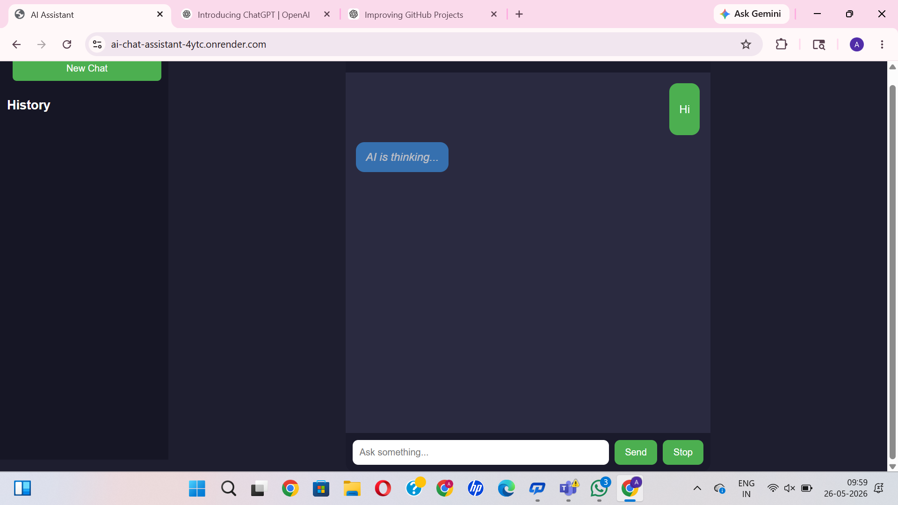
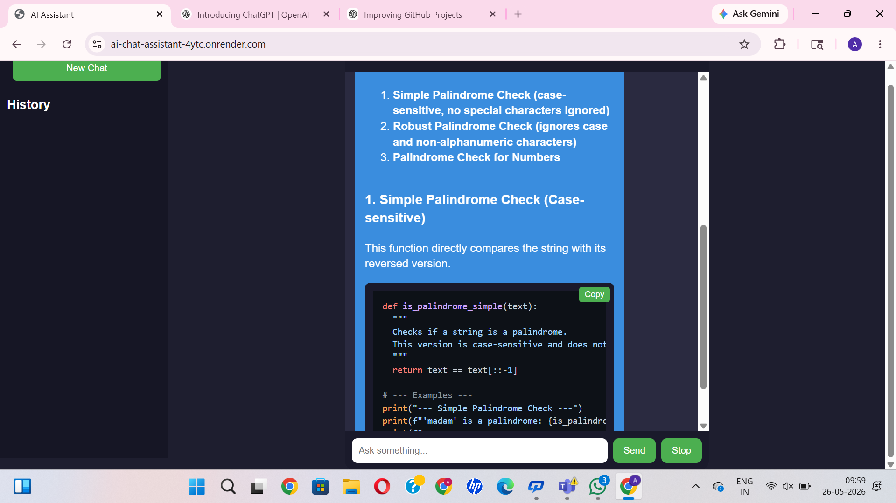

# AI Chat Assistant

Full-stack AI chatbot built using Node.js, Express, Gemini API, and SQLite.

The application supports markdown rendering, syntax-highlighted code blocks, typing animations, persistent chat history, and a responsive modern chat interface.

---

## Live Demo

🚀 https://ai-chat-assistant-4ytc.onrender.com

---

## Preview

### Chat Interface

<p align="center">
  
</p>

---

### Markdown & Code Rendering

<p align="center">
  
</p>

---

## Features

- AI-powered conversations using Gemini API
- Markdown response rendering
- Syntax-highlighted code blocks
- Copy code functionality
- Typing animation
- Stop response generation
- Persistent chat history using SQLite
- Responsive chat interface

---

## Tech Stack

| Technology | Purpose |
|---|---|
| Node.js | Backend runtime |
| Express.js | API server |
| Gemini API | AI response generation |
| SQLite | Chat history storage |
| HTML/CSS/JavaScript | Frontend UI |

---

## Project Structure

```text
ai-chat-assistant/
│
├── assets/
│   ├── chat-ui.png
│   └── code-rendering.png
│
├── database/
├── public/
│
├── server.js
├── listModels.js
├── package.json
├── package-lock.json
├── README.md
└── .gitignore
```

---

## How It Works

1. User sends a message through the frontend chat interface
2. Express backend processes the request
3. Gemini API generates AI responses
4. Responses are rendered with markdown formatting
5. Chat history is stored in SQLite database
6. Code blocks support syntax highlighting and copy actions

---

## Installation

Clone the repository:

```bash
git clone https://github.com/atulsharma47/ai-chat-assistant.git
```

Install dependencies:

```bash
npm install
```

---

## Environment Variables

Create a `.env` file:

```env
GEMINI_API_KEY=your_api_key
```

---

## Run Locally

```bash
npm start
```

Open:

```text
http://localhost:3000
```

---

## Future Improvements

- Streaming AI responses
- Multi-chat sessions
- User authentication
- Voice input support
- File upload & AI analysis
- Multi-model AI support

---

## Author

Atul Sharma

GitHub: https://github.com/atulsharma47
